# Pelicans on a bicycle

Prompt:

> `Generate an SVG of a pelican riding a bicycle`

## Cerebras Llama models

### Cerebras Llama 3.1 70B
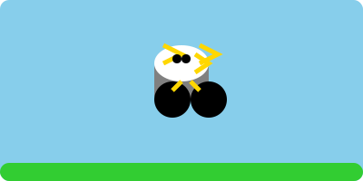

### Cerebras Llama 3.1 8B
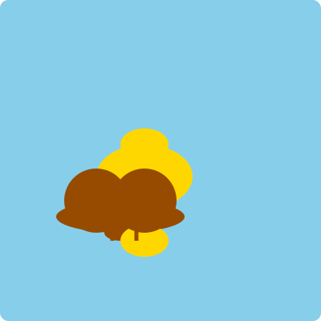

## Claude models

### Claude 3.5 Sonnet (2024-06-20)

### Claude 3.5 Sonnet (2024-10-22)
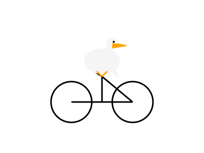

### Claude 3 Haiku

### Claude 3 Opus
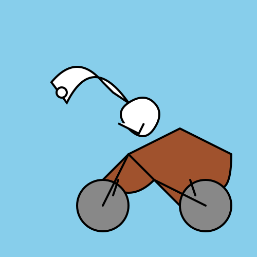

## Gemini models

### Gemini 1.5 Flash 001
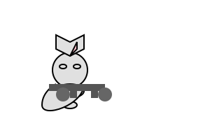

### Gemini 1.5 Flash 002
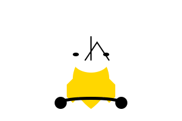

### Gemini 1.5 Flash 8B 001
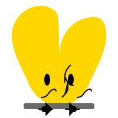

### Gemini 1.5 Pro 001
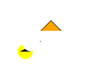

### Gemini 1.5 Pro 002
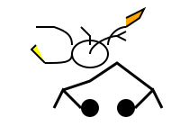

## OpenAI models

### GPT-3.5 Turbo

### GPT-4o mini
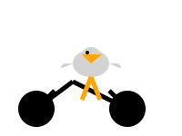

### GPT-4o
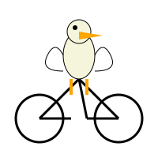

### o1-mini
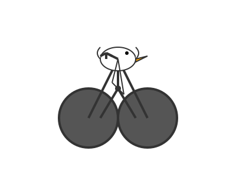

### o1-preview
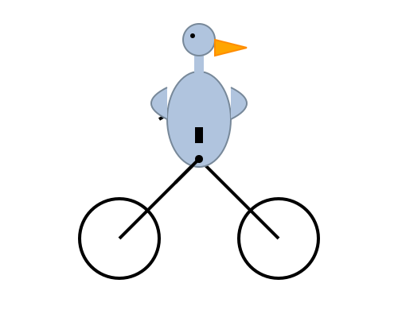

### ChatGPT o1 pro mode
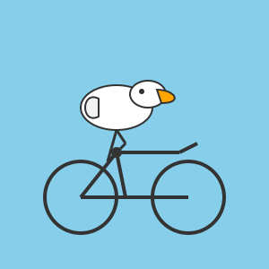
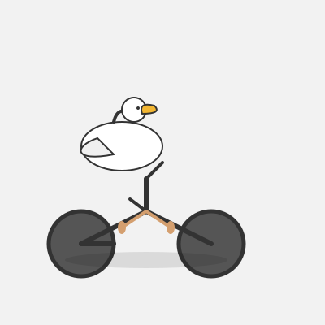
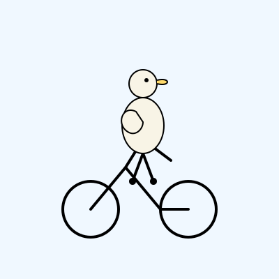

### ChatGPT o3-mini, high reasoning effort
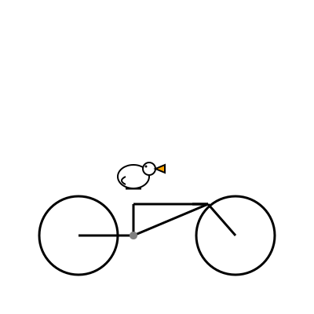

## Amazon Bedrock models

### Llama 3.2 3B

### Llama 3.1 8B

### Llama 3.1 70B

### Llama 3.1 405B
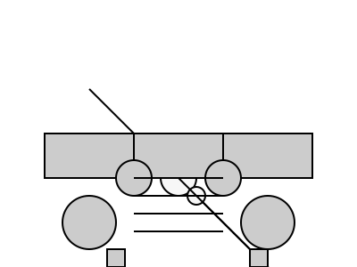

### Mistral Large V2 (2407)

### Nova Pro V1
#### Temp 0.7, Top P 0.9
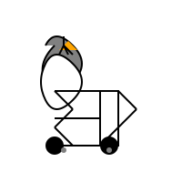
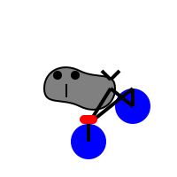
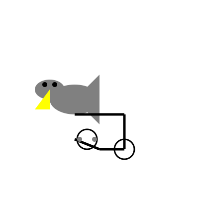

#### Temp 1, Top P 0.9
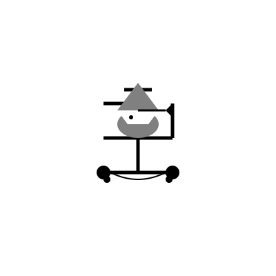

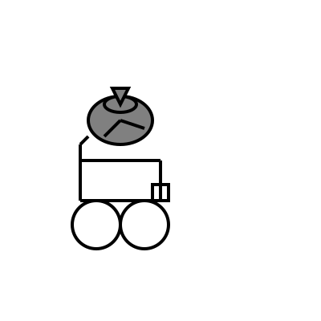

## Hyperbolic models

### Llama 3.1 8B BF16
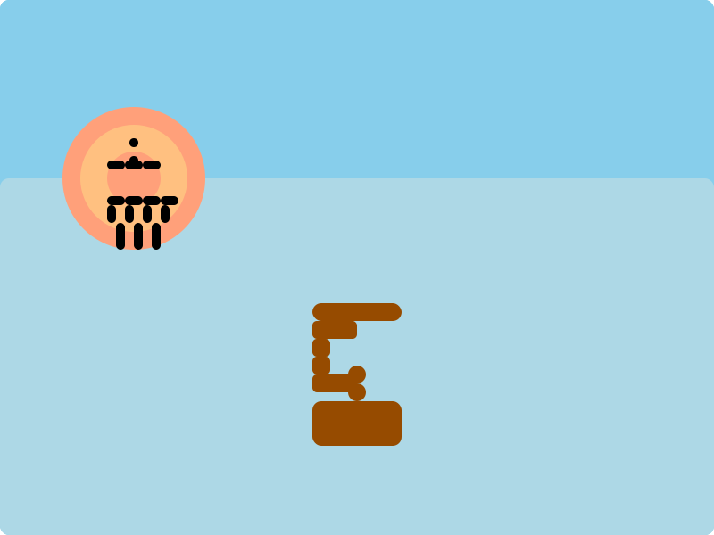

### Llama 3.1 405B BF16
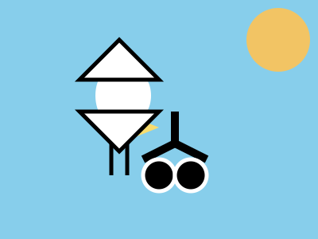

### Llama 3.2 90B Vision Instruct BF16
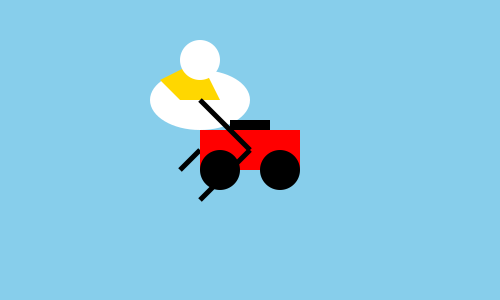
