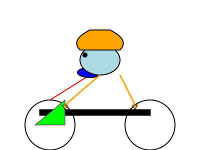
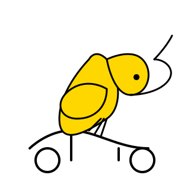
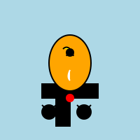
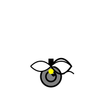
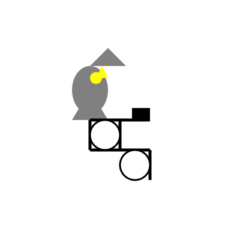

# Pelicans on a bicycle

Prompt:

> `Generate an SVG of a pelican riding a bicycle`

## Cerebras Llama models

### Cerebras Llama 3.1 70B

### Cerebras Llama 3.1 8B

## Claude models

### Claude 3.5 Sonnet (2024-06-20)

### Claude 3.5 Sonnet (2024-10-22)

### Claude 3 Haiku

### Claude 3 Opus

## Gemini models

### Gemini 1.5 Flash 001

### Gemini 1.5 Flash 002

### Gemini 1.5 Flash 8B 001

### Gemini 1.5 Pro 001

### Gemini 1.5 Pro 002

### gemini-exp-1114

### gemini-exp-1121

## OpenAI models

### GPT-3.5 Turbo

### GPT-4o mini

### GPT-4o

### o1-mini

### o1-preview

## AWS models

### Amazon Nova Micro

### Amazon Nova Lite

### Amazon Nova Pro

