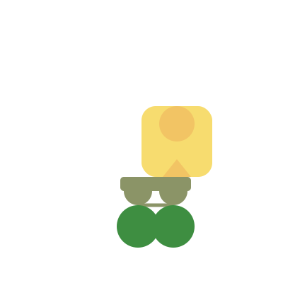
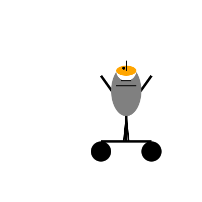

# Pelicans on a bicycle

Prompt:

> `Generate an SVG of a pelican riding a bicycle`

## Cerebras Llama models

### Cerebras Llama 3.1 70B

### Cerebras Llama 3.1 8B

## Claude models

### Claude 3.5 Sonnet (2024-06-20)

### Claude 3.5 Sonnet (2024-10-22)

### Claude 3 Haiku

### Claude 3 Opus

## Gemini models

### Gemini 1.5 Flash 001

### Gemini 1.5 Flash 002

### Gemini 1.5 Flash 8B 001

### Gemini 1.5 Pro 001

### Gemini 1.5 Pro 002

## OpenAI models

### GPT-3.5 Turbo

### GPT-4o mini

### GPT-4o

### o1-mini

### o1-preview

### ChatGPT o1 pro mode

### ChatGPT o3-mini, high reasoning effort

## Amazon Bedrock models

### Llama 3.2 3B

### Llama 3.1 8B

### Llama 3.1 70B

### Llama 3.1 405B

### Mistral Large V2 (2407)

### Nova Pro V1
#### Temp 0.7, Top P 0.9

#### Temp 1, Top P 0.9

## Hyperbolic models

### Llama 3.1 8B BF16

### Llama 3.1 405B BF16

### Llama 3.2 90B Vision Instruct BF16

